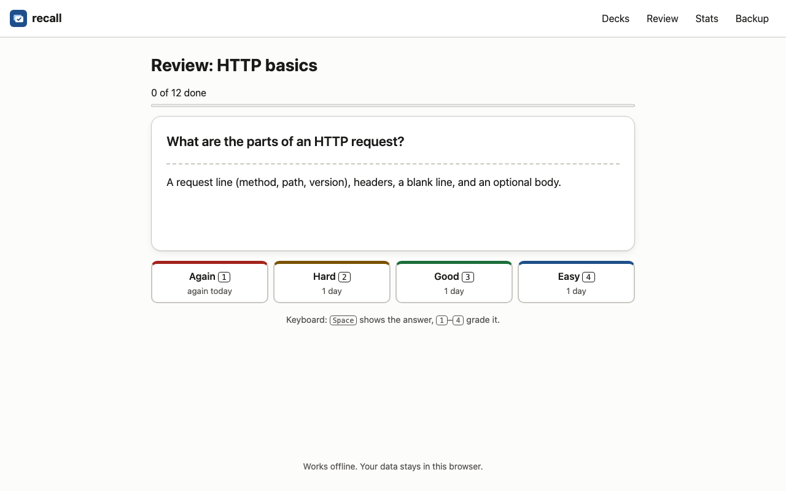
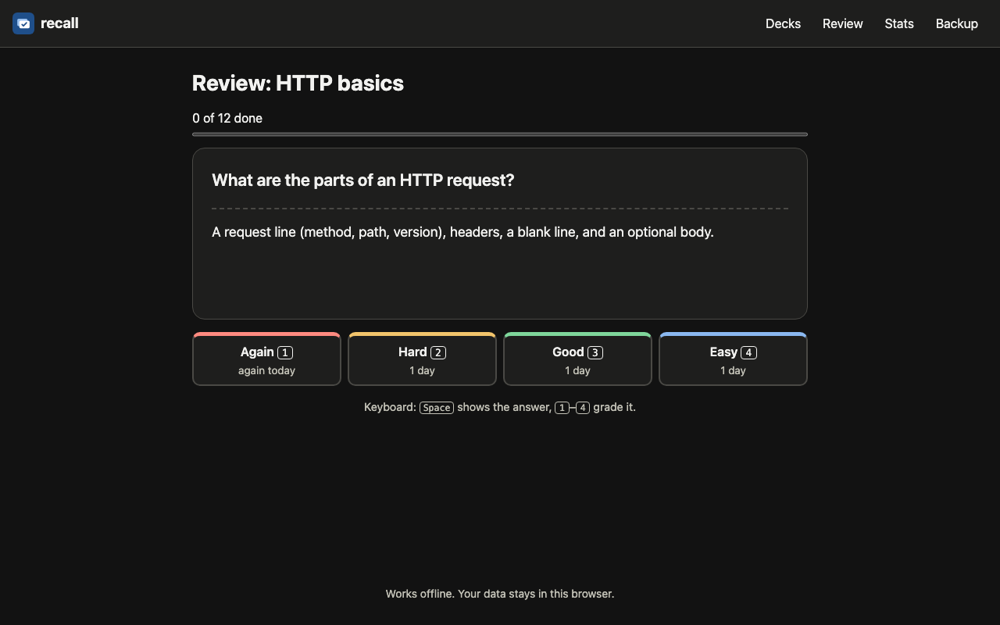
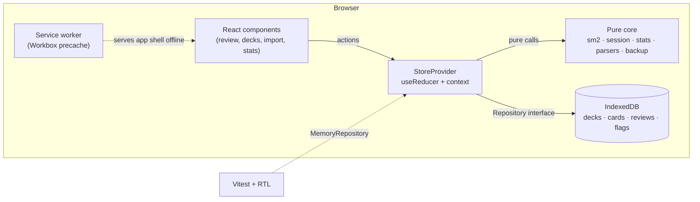

# recall

An offline-first flashcard PWA with SM-2 scheduling, Markdown/CSV import and keyboard-driven study.

[](https://github.com/srujanmalakpata/recall/actions/workflows/ci.yml)
[](LICENSE)
[](https://www.typescriptlang.org/)
[](https://nodejs.org/)

**Live demo:** https://srujanmalakpata.github.io/recall/

<p align="center">
  
  
</p>

## Highlights

- **199 unit, property and component tests; 96.4% line coverage**, measured with
  `npm run test:coverage`. [Verification](VERIFICATION.md#current-verification-2026-10-03).
- **Pure SM-2 scheduling with invariant checks**: `sm2.test.ts` enforces the ease floor, growing
  successful intervals and lapse rules with fast-check. [Test inventory](VERIFICATION.md#test-inventory).
- **Transactional writes across tabs**: repository contracts and `ReviewSession.test.tsx`
  prevent duplicate grading and stale-card overwrites. [Design](DESIGN.md) · [test inventory](VERIFICATION.md#test-inventory).
- **Local-first storage and an offline app shell**: IndexedDB holds cards and reviews; Workbox
  precaches the production build and updates wait for explicit consent. [Architecture](#architecture).
- **Lossless Markdown/CSV interchange and validated backups**: round-trip properties,
  line-numbered import errors and a spreadsheet formula-injection guard. [Test inventory](VERIFICATION.md#test-inventory).

**Tech stack:** React 19 · TypeScript 5.9 (strict) · Vite 8 · IndexedDB (`idb`) · Workbox ·
Vitest / Testing Library / fast-check · Playwright / axe-core. No backend or account required.

## Quickstart

Use Node.js 22.20+ LTS and npm (also supports Node 24.12+ LTS or 26+). From a fresh clone:

```bash
git clone https://github.com/srujanmalakpata/recall.git
cd recall
npm ci
npm run build
npm run preview
```

Open http://localhost:4173, choose a sample deck and start reviewing: **Space** reveals the answer;
**1–4** grades it. For offline mode, first wait for DevTools → Application → Service Workers to show
an activated worker controlling the page, then switch Network to Offline and reload. For development,
use `npm run dev` at http://localhost:5173; the service worker runs only in production builds.

Contents: [Architecture](#architecture) · [Features](#features) · [Import formats](#import-formats) ·
[Checks](#tests-and-checks) · [Results](#results) · [Limitations](#limitations) · [License](#license).

## Architecture



```
src/
  domain/   types, sm2 (scheduler), session (review state machine), stats, days   ← pure
  io/       markdown + csv import/export, backup validation                       ← pure
  storage/  Repository interface, IndexedDbRepository (idb), MemoryRepository, persistent-storage request
  state/    appReducer + StoreProvider (the only place that touches clock + storage), cross-tab change feed
  router/   tiny hash router
  components/ App, ReviewSession, ImportPanel, DeckView, StatsView + SVG BarChart, ErrorBoundary, …
e2e/        Playwright specs (+ axe-core) run against `vite preview`
scripts/    base-path-smoke.ts (offline Pages sub-path check), screenshots.ts, generate-icons.ts
```

Writes go to IndexedDB first and are dispatched to React state only after they succeed. See
[DESIGN.md](DESIGN.md) for the trade-offs.

## Features

It schedules every card with the
**SM-2 spaced-repetition algorithm**, stores everything in **IndexedDB**, and keeps working with the
network off after the first visit thanks to a **service worker**. You can import the Q&A sections of
your own Markdown notes (`### question` followed by the answer) or a CSV file, review with the
keyboard only (Space to reveal, 1–4 to grade), and see your reviews per day, retention and upcoming
workload in SVG charts. It is built with React 19, strict TypeScript and Vite, and tested at
three levels: Vitest unit and property tests, React Testing Library component tests, and Playwright
end-to-end tests with axe-core accessibility scans against the production build.

- **SM-2 scheduler** as a pure TypeScript module (`src/domain/sm2.ts`): ease factor, 1 → 6 → n×EF
  intervals, lapses and a 1.3 ease floor. Unit tests plus fast-check property tests for its
  invariants. Where it departs from the 1987 text (interval uses the updated EF, only Again is
  repeated in the session, no extra ease penalty for same-day repeats), it says so: see
  [DESIGN.md, "SM-2 deviations"](DESIGN.md#sm-2-deviations).
- **Decks and cards CRUD**: create, rename, delete decks; add, edit, delete cards with validation.
- **Markdown import**: each `### heading` is a question, the text below it is the answer (code
  blocks and `####` sub-headings stay in the answer). Markdown Q&A decks import directly. An
  unclosed code block is reported on the line that opened it.
- **CSV import/export** (RFC 4180 quoting, spreadsheet formula-injection guard) and lossless
  **Markdown export**; a preview lists line-numbered problems and imports only the valid cards.
- **JSON backup and restore**, validated field by field (same rules as the editor) before anything
  is replaced; the Backup page also shows whether the browser granted persistent storage.
- **Offline-first**: Workbox service worker precaches the app; data never leaves the browser. New
  versions wait for a "Reload to update" click instead of reloading open tabs.
- **Safe in several tabs**: reviews and edits are computed from the stored card inside the
  IndexedDB transaction, a card another tab already reviewed leaves this tab's queue instead of
  being graded twice, cards cannot be added to a deck another tab deleted, and a `BroadcastChannel`
  tells other tabs to refresh.
- **Stays correct overnight**: the current day is React state, updated by a timer at local midnight
  and when the app regains focus, so an installed app left open shows the cards that fell due.
- **Keyboard-first, accessible review**: Space / 1–4 (Enter and Space still work normally on links
  and buttons), managed focus, one ARIA live region for progress, visible focus rings, WCAG AA
  contrast in light and dark themes, `prefers-reduced-motion`.
- **Statistics**: reviews per day (30 days), true retention, due forecast (14 days), card maturity,
  drawn as SVG with a table alternative.
- **Sample decks** (Data structures, HTTP basics) seeded on first open.

## Import formats

Markdown import format:

```markdown
# Deck title (optional)

### What does HTTP 304 mean?

The cached copy is still valid; no body is sent.
```

CSV import needs a header row naming `front` and `back` (or `question` and `answer`) columns.

## Tests and checks

```bash
npm run lint            # ESLint (typescript-eslint strict-type-checked, react-hooks)
npm run format:check    # Prettier
npm run typecheck       # tsc --noEmit, strict + noUncheckedIndexedAccess
npm test                # Vitest unit, property and component tests
npm run test:coverage   # same, with v8 coverage
npm run e2e             # Playwright + axe-core against the production build (vite preview)
npm run check           # all of the above, plus the build
npm run smoke:base      # check assets, service-worker scope and offline reviews under /recall/
npm run screenshots     # build, serve and capture the study screen in light/dark themes
```

Playwright starts `vite preview` itself; run `npm run build` first. On a fresh machine install the
browser with `npx playwright install --with-deps chromium`. If you already have a matching Chromium
elsewhere, set `CHROMIUM_PATH` to its executable.

CI (`.github/workflows/ci.yml`) runs lint, format, typecheck, coverage, the production build,
Playwright and the offline Pages sub-path smoke test. `.github/workflows/deploy.yml` deploys
a `main` commit after the whole CI workflow passes on it (one-time setup: **Settings → Pages → Source:
GitHub Actions** and the repository variable `PAGES_ENABLED=true`). Manual runs also target `main`. The build uses the base path reported by
`actions/configure-pages` (`/recall/` here), with a matching service-worker scope, precached
navigation fallback and `404.html` for Pages navigation. App routes use hashes (`/recall/#/stats`).
For another repository name, run `BASE_PATH=/<repo>/ npm run smoke:base`.

`npm run screenshots` builds and serves locally on port 4181, seeds sample data in fresh browser
contexts, and writes the two study-screen PNGs linked above at 1280×800. Install Chromium with the
command above first; `CHROMIUM_PATH` is supported here too.

## Results

The current macOS verification (2026-10-03, Node 26.10.0) passed the cached lockfile install,
lint, formatting, strict typechecking, all 199 tests and the production build. Overall line
coverage remains 96.4%. On the same Mac, all 10 Playwright end-to-end tests (including offline
service-worker reload and axe-core light/dark scans) passed in Chromium, and `npm run screenshots`
produced the images above. Resolving the latest
Playwright version also needs unavailable registry access. See [VERIFICATION.md](VERIFICATION.md#current-verification-2026-10-03).

Earlier baseline, before the changes in this checkout: measured on a shared 4-vCPU Linux container, 2026-10-03 (Node 22.22, Chromium 141 via Playwright
1.56.1), from a clean state (build outputs, caches and `node_modules` removed, then `npm ci`). Test details and recorded
commands are in [VERIFICATION.md](VERIFICATION.md).

| Check                                          | Result                                                        |
| ---------------------------------------------- | ------------------------------------------------------------- |
| Vitest unit + property + component tests       | 199 passed in 20 files                                        |
| Line coverage (v8, `src/`)                     | 96.4% overall; `src/domain`, `src/storage`, `src/router` 100% |
| Playwright end-to-end tests (production build) | 10 passed                                                     |
| axe-core WCAG 2.0/2.1/2.2 A+AA scans           | 0 violations on 7 screens × light and dark themes             |
| GitHub Pages sub-path smoke test               | passed (`/recall/`, service-worker scope matches)             |
| ESLint / Prettier / `tsc --noEmit`             | clean                                                         |
| Production JS bundle                           | 280.65 kB (88.54 kB gzip)                                     |
| Service-worker precache                        | 12 entries, 300.21 KiB                                        |

## Limitations

- Data lives only in this browser's IndexedDB; moving devices means downloading and restoring a JSON
  backup. There is no sync and no account.
- Unless the browser grants persistent storage (Backup page → "Ask the browser to keep my data"),
  IndexedDB is best-effort: it can be evicted when disk space runs low, and Safari deletes it after 7
  days without a visit for sites that are not installed. Keep a backup.
- Several tabs are supported for reviews and card edits (read-modify-write in one transaction, plus
  a `BroadcastChannel` refresh), but deck renames are last-write-wins, and two tabs opened at the
  same instant on the very first run could both add the sample decks.
- A review session that is running at midnight keeps its queue; cards that fell due overnight are
  offered on the summary screen ("Review N more due cards") rather than added mid-session.
- The "Reload to update" flow is covered by a component test (real registration code, Workbox module
  mocked) only; no end-to-end test deploys two versions.
- Answers are plain text (no Markdown rendering, images or syntax highlighting).
- No limit on new cards per day; a large import makes every card due at once (sessions cap at 100).
- SM-2 is a 1987 algorithm; newer schedulers such as FSRS need fewer reviews for the same retention.
- Accessibility was checked with axe-core and keyboard tests only, not with a manual screen-reader
  session; automated tools catch only part of real accessibility issues.

## License

MIT, see [LICENSE](LICENSE).
